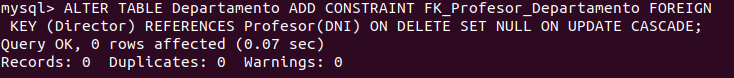
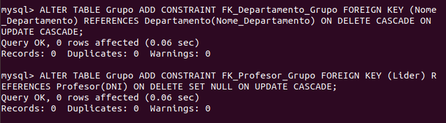
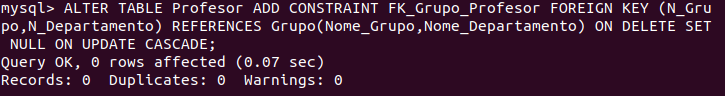
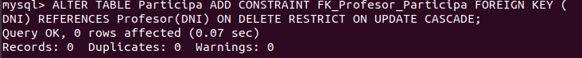
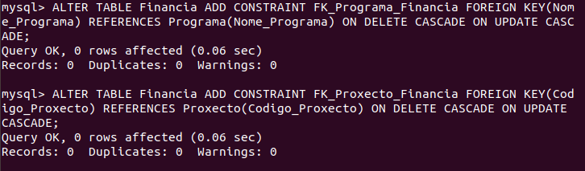

Las tablas claves foráneas son las siguientes:
<ul>
  <li>Departamento</li>
  
  <li>Grupo</li>
  
  <li>Profesor</li>
  
  <li>Participa</li>
  
  <li>Proxecto</li>
  
  <li>Financia</li>
  
</ul>
