<h1>Proyectos de Investigación</h1>
El enunciado del ejercicio podrás encontrarlo en el siguiente enlace de davidgchaves: <a href="https://github.com/davidgchaves/first-steps-with-git-and-github-wirtz-asir1-and-dam1/tree/master/exercicios-ddl/1-proxectos-de-investigacion">Enunciado Proyecto de Investigacion</a> 
<h2>Crear Base de Datos</h2>
Para crear la base de datos debemos escribir lo siguiente: <b>CREATE DATABASE <i>nombreBD</i>;</b>

Una vez hecho esto deberemos indicar que queremos hacer operaciones con esa base de datos por lo que deberemos usar lo siguiente: <b>USE <i>nombreBD</i>;</b>

 
<h2>Crear Tablas</h2>
<b>NOTA:</b> A mi me parece más cómodo primero crear las tablas con las PRIMARY KEY y una vez creadas las tablas poner todas las claves foraneas.<br/<
Lo primero es crear las tablas. Para ello se utiliza lo siguiente: <b>CREATE TABLE <i>nombreTabla</i> (campo1 tipo, campo2 tipo, ...);</b> 

Dato: Para poner la PRIMARY KEY se escribe lo siguiente dentro del CREATE TABLE (Ver imagen anterior): <b>CONSTRAINT <i>nuevoNombre</i> PRIMARY KEY (<i>nombreCampo</i>)</b> 
Una vez creada la tabla podemos comprobar que se ha creado correctamente y ver sus propiedades. Para ello usamos: <b>DESCRIBE <i>nombreTabla</i>;</b>
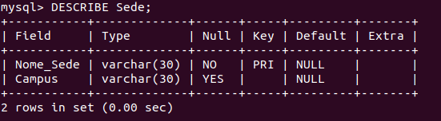

<h3>Creación y Comprobacion de las Tablas del Ejercicio</h3>
Antes de hacer las claves foráneas, hay que crear las tablas que faltan.  
En el siguiente enlace podreis ver la creacion de las tablas restantes del ejercicio: <a href="https://github.com/MercedesRegueiro/CreacionBasesDeDatos/tree/master/1_ProyectosInvestigacion/TablasEjercicio1">Crear Tablas Restantes</a>

<h2>Poner Claves Foráneas</h2>
Para poner las claves foráneas debemos escribir lo siguiente:<b>ALTER TABLE <i>nombreTabla</i> ADD CONSTRAINT <i>nuevoNombre</i> FOREIGN KEY (<i>nombreCampo</i>) REFERENCES <i>nombreTabla2</i>(<i>nombreCampo2</i>) ON DELETE <i>Tipo</i> ON UPDATE <i>Tipo</i>;</b> 
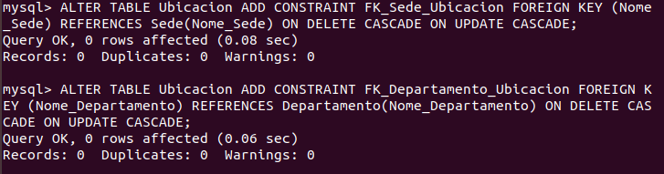

<h3>Claves Foraneas Del Ejercicio</h3>
Antes de empezar a poner los datos en la tabla se debe poner todas las claves foráneas de la base de datos y deste modo no tendremos problemas para ponerlas después. 
En el siguiente enlace podreis ver las claves foráneas de las tablas restantes:<a href="https://github.com/MercedesRegueiro/CreacionBasesDeDatos/tree/master/1_ProyectosInvestigacion/ClavesForaneasEjercicio1">Poner Claves Foráneas Restantes</a> 

<h2>Resultado Final</h2>
Una vez hecho todo esto, vemos la tabla usando el siguiente comando: <b>DESCRIBE <i>nombreTabla</i></b> 
Podemos observar que marca cuales son claves primarias y claves foráneas, si un campo es tanto una clave foránea como una clave primaria solo marcará la calve primaria. A continuación veremos el resultado de todas las tablas. 
<b>TABLAS:</b> 
<ul>
  <li>Sede</li>
  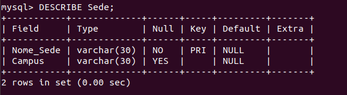
  <li>Ubicacion</li>
  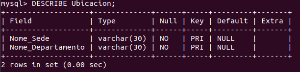
  <li>Departamento</li>
  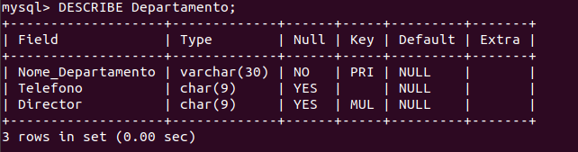
  <li>Grupo</li>
  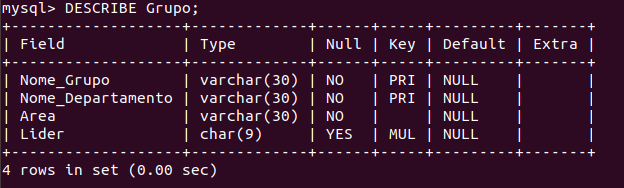
  <li>Profesor</li>
  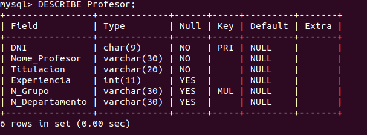
  <li>Participa</li>
  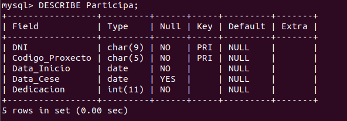
  <li>Proxecto</li>
  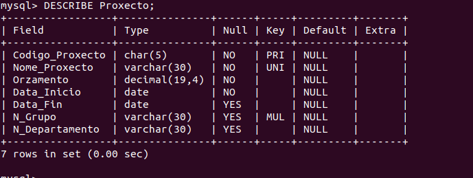
  <li>Programa</li>
  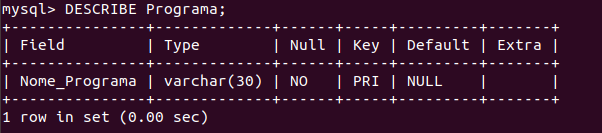
  <li>Financia</li>
  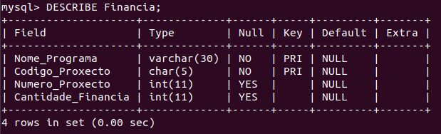
</ul>
