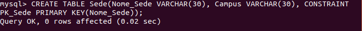

ons<h1>Proyectos de Investigación</h1>
El enunciado del ejercicio podrás encontrarlo en el siguiente enlace de davidgchaves: <a href="https://github.com/davidgchaves/first-steps-with-git-and-github-wirtz-asir1-and-dam1/tree/master/exercicios-ddl/1-proxectos-de-investigacion">Enunciado Proyecto de Investigacion</a> 
<h2>Crear Base de Datos</h2>
Para crear la base de datos debemos escribir lo siguiente: <b>CREATE DATABASE <i>nombreBD</i>;</b>

Una vez hecho esto deberemos indicar que queremos hacer operaciones con esa base de datos por lo que deberemos usar lo siguiente: <b>USE <i>nombreBD</i>;</b>

<h2>Crear Tablas</h2>
<b>NOTA:</b> A mi me parece más cómodo primero crear las tablas con las PRIMARY KEY y una vez creadas las tablas poner todas las claves foraneas.<br/<
Lo primero es crear las tablas. Para ello se utiliza lo siguiente: <b>CREATE TABLE <i>nombreTabla</i> (campo1 tipo, campo2 tipo, ...);</b> 

Dato: Para poner la PRIMARY KEY se escribe lo siguiente: CONSTRAINT <i>nuevoNombre</i> PRIMARY KEY (<i>nombreCampo</i>);
