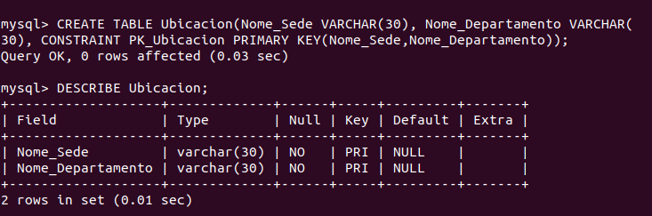
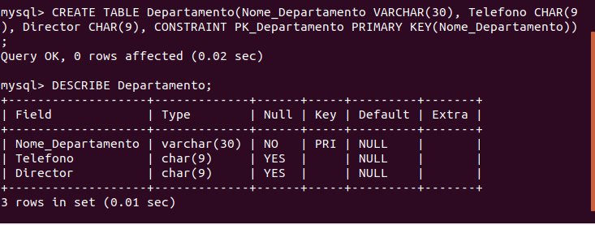
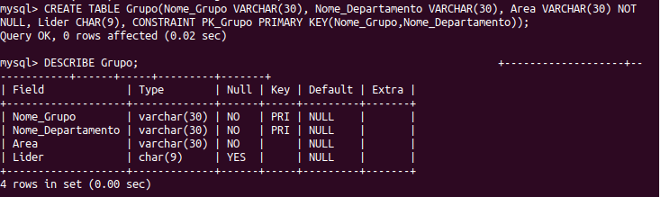
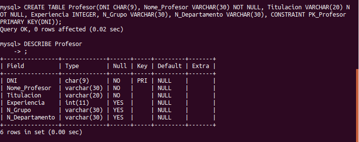
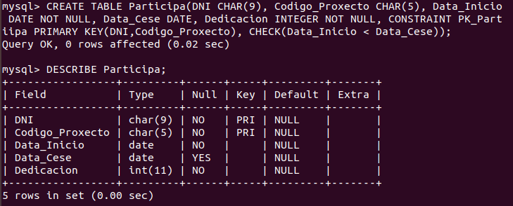
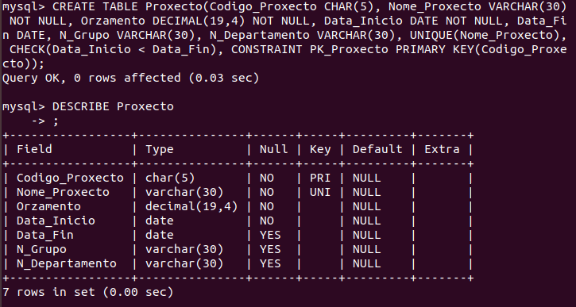
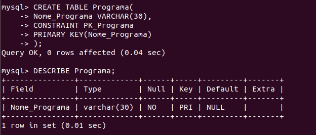
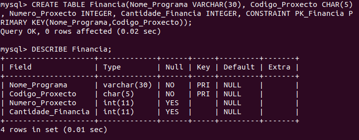

Las tablas restantes son las siguientes:
<ul>
  <li>Ubicacion</li>
  
  <li>Departamento</li>
  
  <li>Grupo</li>
  
  <li>Profesor</li>
  
  <li>Participa</li>
  
  <li>Proxecto</li>
  
  <li>Programa</li>
  
  <li>Financia</li>
  
</ul>

Pulse aquí para volver al documento Principal: <a href="https://github.com/MercedesRegueiro/CreacionBasesDeDatos/tree/master/1_ProyectosInvestigacion">Investigacion</a>

