<h1>Naves Espaciais</h1>
El enunciado del ejercicio podrás encontrarlo en el siguiente enlace de davidgchaves: <a href="https://github.com/davidgchaves/first-steps-with-git-and-github-wirtz-asir1-and-dam1/tree/master/exercicios-ddl/2-naves-espaciais">Enunciado Naves Espaciais</a> 
<h2>Creacion de Base de Datos</h2>

<h2>Creacion de las tablas</h2>
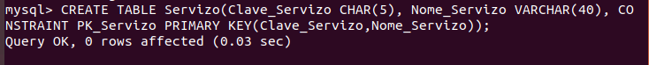
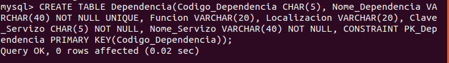
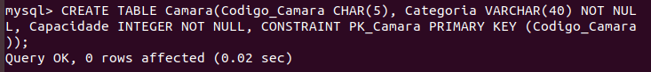
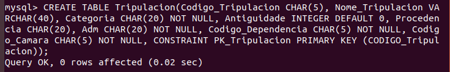
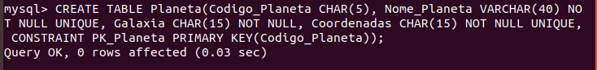
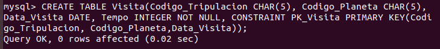
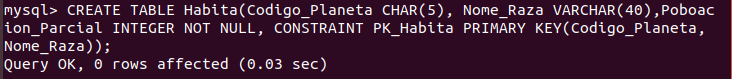
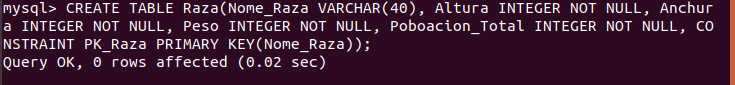
<h2>Claves Foráneas</h2>
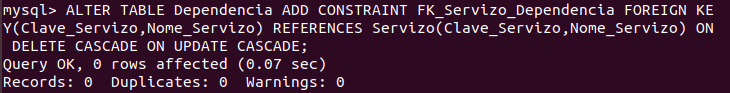
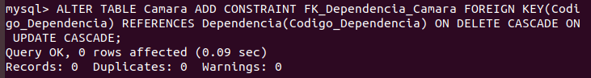
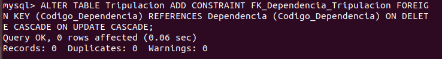
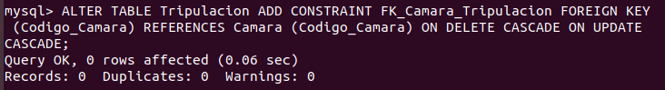
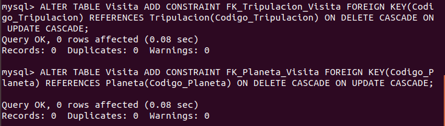
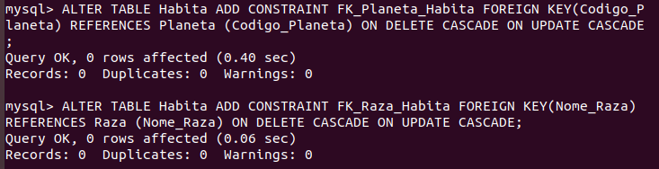
<h2>Tablas</h2>

