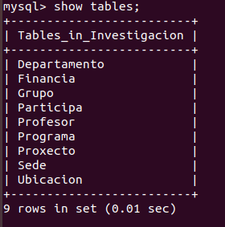
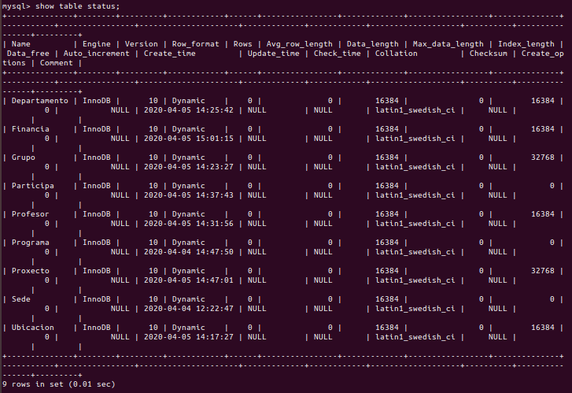

<h1>Comandos para ver informacion sobre las Bases de Datos</h1>
Para ver las tablas que hay en la base de datos se usa el comando <i>show tablas;</i>

Para ver la informacion que contiene cada tabla se usa el comando <i>show table status;</i>

Para ver la informacion que hay en una tabla especifica se usa el comando <i>show table status 'nombre_tabla';</i>

Para saber que campos y de que tipo son los que continene una tabla se usa el comando <i>DESCRIBE 'nombre_tabla';</i>

